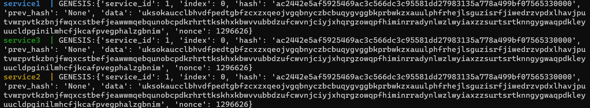
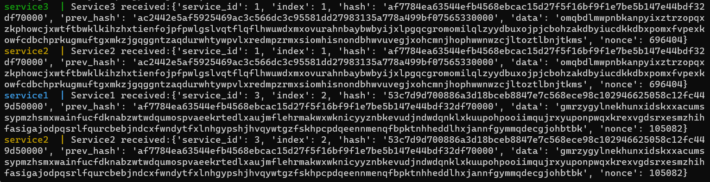

# MyFirstBlockChain
## Запуск через Docker Compose
`docker build -t first/blockchain:latest .`\
`docker-compose up` 
## Демонстрация работы
Service 1 гененирует блок генезис: index = 0, prev_hash = 'None', и отправляет его Service 2 и Service 3, которые выводят информацию с данными о полученном блоке.

Далее опять Service 1 создает новый блок уже с index = 1, prev_hash = хэш блока генезиса, и также оптравляет Service 2 и Service 3, после чего они также выводят информацию о полученном блоке. Третий блок создает уже Service 3,  Service 1 и Service 2 сообщают информацию о новом блоке
